# RecoverAI — AI Revenue Recovery Agent

> **Prototype/Demo System. No real money is processed.**

RecoverAI is a production-quality MVP of an AI-powered Revenue Recovery Agent for failed payments. The system demonstrates genuine agentic behavior: it **observes**, **reasons**, **decides**, **acts**, **observes results**, and **stops within explicit bounds** — not a chatbot, not a static dashboard.

---

## Problem Statement

Failed payments are a silent revenue drain. In Indian e-commerce and SaaS, payment failure rates of 15–30% are common. Most systems retry blindly, waste customer contacts, and either:
- Retry hard declines that can never succeed
- Miss recoverable transient failures
- Contact customers too many times and damage relationships

## Why It Matters

Every 1% improvement in payment recovery on ₹10Cr monthly GMV = ₹10L/month additional revenue. More importantly, intelligent recovery preserves customer relationships by acting only when warranted, with the right action.

## Solution

RecoverAI implements a bounded autonomous agent that:
1. **Detects** failed payments and quantifies revenue at risk
2. **Diagnoses** root cause using a deterministic taxonomy (not LLM guessing)
3. **Scores** recovery probability using a trained ML model with heuristic fallback
4. **Prioritizes** payments using an explainable formula
5. **Decides** on exactly ONE action using policy guardrails
6. **Executes** the action via a controlled mock gateway
7. **Observes** the outcome and updates state
8. **Stops** when rules require — never retries indefinitely

---

## Architecture

```mermaid
flowchart TD
    FE["Frontend\nReact + Vite + Tailwind"]
    BE["Backend\nNode.js + Express"]
    ML["ML Service\nPython + Flask"]
    MG["Mock Gateway\nSeeded RNG"]
    DB["MongoDB\nPayments, Decisions, Events"]
    LLM["LLM Service\nGemini/OpenAI/Anthropic"]

    FE -->|REST + SSE| BE
    BE -->|POST /predict| ML
    BE -->|POST /retry, /notify...| MG
    BE <--> DB
    BE -->|Explanation enrichment| LLM
    LLM -.->|Fallback if unavailable| BE

    style FE fill:#1c2540,stroke:#4f6ef7
    style BE fill:#1c2540,stroke:#4f6ef7
    style ML fill:#1c2540,stroke:#10b981
    style DB fill:#1c2540,stroke:#f59e0b
    style LLM fill:#1c2540,stroke:#8b5cf6
```



---

## Agent Workflow

```
PAYMENT FAILURE
    → DETECT (revenue at risk)
    → DIAGNOSE (deterministic taxonomy + optional LLM enrichment)
    → ESTIMATE RECOVERY PROBABILITY (ML model / heuristic fallback)
    → CALCULATE PRIORITY SCORE (explainable formula)
    → ANALYZE CUSTOMER HISTORY
    → CHECK GUARDRAILS (7 configurable rules)
    → SELECT EXACTLY ONE ACTION
    → LOG DECISION (fully auditable)
    → EXECUTE ACTION (mock gateway)
    → OBSERVE OUTCOME
    → UPDATE PAYMENT STATE
    → [RECOVERED] Record revenue
    → [FAILED]    Determine if another bounded step allowed
    → [UNCERTAIN] Escalate to human
    → [LIMIT]     Stop
```

---

## ML Approach

- **Model**: Calibrated Random Forest (scikit-learn)
- **Features**: amount, payment method, failure category, attempt number, previous success rate, previous failures, customer tenure, subscription status
- **Training**: 5,000 synthetic payments, 80/20 train/test split, stratified
- **Metrics** (actual, not fabricated):
  - Precision: 0.69
  - Recall: 0.22
  - F1: 0.33
  - ROC-AUC: 0.74
- **Calibration**: Isotonic calibration to ensure probabilities are meaningful
- **Fallback**: Heuristic scoring clearly labeled if ML unavailable

> Note: Low F1 is expected — payment recovery is highly imbalanced (30% positive class). ROC-AUC of 0.74 means the model has real discriminative power. Probabilities are calibrated and used for prioritization, not just classification.

---

## AI Approach

The LLM is used **only for explanation**, never for classification or action selection:

- **Diagnosis**: Deterministic taxonomy maps failure reason → category + confidence. LLM optionally enriches the explanation in plain English.
- **Decision**: Policy guardrails select the action. LLM optionally writes the human-readable reason narrative.
- **Safety**: LLM cannot change the action, cannot invent facts, cannot execute arbitrary commands.
- **Fallback**: Fully functional without LLM. Deterministic explanations are always available.

---

## Decision Policy

| Condition | Action |
|---|---|
| Confidence < 60% | ESCALATE_TO_HUMAN |
| Attempt ≥ MAX_RETRIES | STOP |
| Recovery probability < 15% | STOP |
| Hard decline + high value | ESCALATE_TO_HUMAN |
| Hard decline + expired/invalid card + good history | SEND_PAYMENT_LINK |
| TRANSIENT + high recovery prob | RETRY_NOW or RETRY_LATER |
| SOFT_DECLINE + moderate recovery | RETRY_LATER |
| CUSTOMER_ACTION_REQUIRED | SEND_REMINDER or SEND_PAYMENT_LINK |
| UNKNOWN + high value | ESCALATE_TO_HUMAN |
| Max customer contacts reached | STOP |

---

## Safety Guardrails

- Never processes real money (mock gateway only)
- Never stores real card details or CVV
- Never retries indefinitely (MAX_RETRIES=3 configurable)
- Never contacts customers more than MAX_CUSTOMER_CONTACTS times
- Never allows LLM to select or execute actions
- Requires human review for ambiguous/high-value cases
- Never fabricates payment status or metrics

---

## Dataset Generation

Synthetic generator produces:
- 5,000+ payments with realistic variation
- Correct failure category distribution (TRANSIENT 25%, SOFT_DECLINE 30%, HARD_DECLINE 25%, etc.)
- Customer profiles: strong, poor, subscription, mixed
- Ground-truth `recovered` field for ML evaluation
- Fixed seed (42) for full reproducibility

20 curated demo cases with predictable outcomes for consistent demos.

---

## Baseline Comparison

The baseline strategy: retry every failed payment → fixed 3-attempt limit → no intelligence.

RecoverAI vs Baseline comparison:
- Recovery rate comparison (actual simulated outcomes)
- Revenue recovered
- Average retries per payment
- Customer contacts
- Human escalations
- Unnecessary actions

All metrics calculated from actual simulated data.

---

## Local Setup

### Prerequisites
- Node.js 18+
- Python 3.10+
- MongoDB (local or Atlas)

### 1. Clone and install

```bash
cd recover-ai

# Backend
cd backend
npm install

# Frontend
cd ../frontend
npm install

# ML
cd ../ml
pip install flask scikit-learn pandas numpy
```

### 2. Configure environment

```bash
# Backend
cp ../。env.example backend/.env
# Edit backend/.env — add MONGODB_URI and optionally LLM_API_KEY
```

### 3. Train the ML model

```bash
cd ml
python generate_dataset.py 5000
python train.py
```

### 4. Start services

**Terminal 1 — Backend:**
```bash
cd backend
npm run dev
# → http://localhost:3001
```

**Terminal 2 — ML Service:**
```bash
cd ml
python server.py
# → http://localhost:5001
```

**Terminal 3 — Frontend:**
```bash
cd frontend
npm run dev
# → http://localhost:5173
```

---

## Environment Variables

| Variable | Default | Description |
|---|---|---|
| `MONGODB_URI` | `mongodb://localhost:27017/recoverai` | MongoDB connection string |
| `LLM_PROVIDER` | `gemini` | LLM provider: `gemini`, `openai`, `anthropic` |
| `LLM_API_KEY` | — | API key for LLM provider |
| `LLM_MODEL` | `gemini-2.0-flash` | Model name |
| `ML_SERVICE_URL` | `http://localhost:5001` | Python ML service URL |
| `PORT` | `3001` | Backend port |
| `DEMO_SEED` | `42` | Random seed for reproducible demos |
| `MAX_RETRIES` | `3` | Maximum retry attempts per payment |
| `MAX_CUSTOMER_CONTACTS` | `2` | Maximum customer notifications |
| `MIN_RECOVERY_PROBABILITY` | `0.15` | Stop if recovery prob falls below this |
| `MIN_CONFIDENCE` | `0.60` | Escalate if confidence falls below this |
| `HIGH_VALUE_THRESHOLD` | `10000` | INR amount for high-value escalation |

---

## API Documentation

### Data
| Method | Path | Description |
|---|---|---|
| POST | `/api/data/demo` | Load 20 curated demo cases |
| POST | `/api/data/generate?count=5000` | Generate synthetic dataset |
| DELETE | `/api/data/reset` | Reset to demo state |
| GET | `/api/data/status` | Data status |

### Payments
| Method | Path | Description |
|---|---|---|
| GET | `/api/payments` | List payments (filterable) |
| GET | `/api/payments/:id` | Payment detail + decision + events |
| GET | `/api/payments/:id/timeline` | Agent activity timeline |
| GET | `/api/payments/queue/priority` | Priority-sorted queue |

### Agent
| Method | Path | Description |
|---|---|---|
| POST | `/api/agent/run` | Start agent processing |
| GET | `/api/agent/status` | Current run state |
| GET | `/api/agent/events` | SSE stream (real-time updates) |

### Metrics
| Method | Path | Description |
|---|---|---|
| GET | `/api/metrics/dashboard` | Top-level dashboard metrics |
| GET | `/api/metrics/summary?source=recoverai` | Detailed metrics by source |
| GET | `/api/metrics/compare` | RecoverAI vs Baseline comparison |

### Human Review
| Method | Path | Description |
|---|---|---|
| GET | `/api/human-review` | Pending human review cases |
| POST | `/api/human-review/:id/approve` | Approve action |
| POST | `/api/human-review/:id/reject` | Reject action |
| POST | `/api/human-review/:id/stop` | Stop case |

### ML Service
| Method | Path | Description |
|---|---|---|
| POST | `/predict` | Predict recovery probability |
| GET | `/health` | Service health + model metrics |

---

## Demo Instructions

1. Open `http://localhost:5173`
2. Click **Generate Demo Data** — loads 20 curated cases
3. Click **Run Recovery Agent** — watch live processing via SSE
4. View the Priority Queue — see all decisions
5. Click any payment — inspect full agent timeline
6. Go to **Human Review** — see escalated cases, approve/reject
7. Click **Run Baseline** — run simple retry strategy
8. Click **Compare Results** → **Compare** tab — side-by-side metrics
9. Click **Reset Demo** — reproduce the exact same run

---

## Limitations

- ML model has low recall (0.22) — expected for imbalanced data, probabilities are calibrated
- LLM enrichment is optional — system works entirely without it
- Mock gateway outcomes are deterministic per seed — not a real payment gateway
- No real-time payment webhooks — demo mode only
- Single-threaded agent — processes payments sequentially

## Future Work

- Webhook integration with real payment gateways (Razorpay, Stripe)
- Customer communication templates (email/SMS/WhatsApp)
- Multi-currency support
- Reinforcement learning from recovery outcomes
- A/B testing different recovery strategies
- Merchant-configurable policy thresholds
- Real-time customer channel integration
- Anomaly detection for unusual failure patterns
